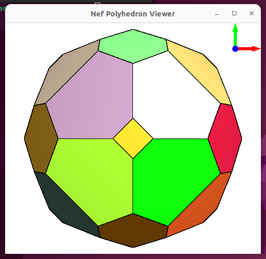

## Basic Viewer

See [prerequisites](#prerequisites), [build](#build) and [demo](#demo) sections — work in progress ...


Below few PARI/GP commands
- determine convex hull of ```points``` (returns ```#vertices```, ```#edges```, ```#halfedges``` and ```#faces```)
- and then display that in CGAL Basic Viewer  
```
pi@raspberrypi5:~/qh $ gp -q BVcgal4.gp
? points=[[1, 0, 0], [2, -1, 0], [2, 0, -1], [3, 0, 0], [2, 1, 0], [2, 0, 1]];
? CGAL_convex_hull_3(points)
[6, 12, 24, 8]
? CGAL_draw()
Using OpenGL context 4.5 GL
```  


### prerequisites

Installed libcgal-dev is version 5.4 on most systems, and that has Qt related bugs not allowing to get CGAL Basic Viewer working. Just  
```
sudo apt remove libcgal-dev
```
and then download [CGAL-5.6.1.zip](https://github.com/CGAL/cgal/releases/download/v5.6.1/CGAL-5.6.1.zip). Unzip under ```$HOME``` and execute  
```
sudo ln -s $HOME/CGAL-5.6.1/include/CGAL /usr/include/CGAL
```
Finally execute these commands:  
```
echo "export CGAL_DIR=$HOME/CGAL-5.6.1" >> ~/.bashrc
source ~/.bashrc
```

#### detailed steps to install Qt

```
sudo apt install qtcreator qtbase5-dev qt5-qmake
```

Work in progress ...

### build

[really_clean](really_clean) does what it says, [build+run](build+run) as well.  
Unlike building in ```cgal4gp``` base directory, here ```cmake``` based build is needed (for the ```Qt``` stuff).

Work in progress ...

### demo

At the end of ```./build+run``` or via ```gp -q < demo.gp``` the demo gets executed. First the known convex hull of 6 points is displayed. Then lattice sphere for n=65 gets displayed, also with ```CGAL_draw()``` which shows the triangulation created with ```CGAL_convex_hull_3()``` for 96 points. Finally same lattice sphere is displayed with ```CGAL_draw_nef()``` which does not display triangulation edges inside a lattice sphere face, but just the faces. Here is the terminal output of the demo:  
```
...
[100%] Built target Qt
CGAL_convex_hull_3([[1, 0, 0], [2, -1, 0], [2, 0, -1], [3, 0, 0], [2, 1, 0], [2, 0, 1]])
[6, 12, 24, 8]

CGAL_draw()
Using OpenGL context 4.6 GL

#points=96
CGAL_convex_hull_3(points)
[96, 282, 564, 188]

CGAL_draw()
Using OpenGL context 4.6 GL

CGAL_draw_nef()
Using OpenGL context 4.6 GL
hermann@7600x:~/cgal4gp/Basic_Viewer$ 
```

This is the first display of convex hull of 6 points:  


The CGAL viewer is libQGlViewer (forked from version 2.7.0). Pressing <kbd>h</kbd> shows extensive help window with more than 50 key and mouse possibilities to control the display. Below screenshots were takes after pressing <kbd>m</kbd> which turns off monochrome display. 

The lattice sphere points for n=65 are created by these 3 lines in [demo.gp](demo.gp}:  
```
n=5*13;
s=sqrtint(n);
points=[[x,y,z]|x<-[-s..s];y<-[-s..s];z<-[-s..s],x^2+y^2+z^2==n];
```

With ```CGAL_draw()``` the convex hull triangulation is displayed:   


Much nicer is display of same lattice sphere with ```CGAL_draw_nef()```that displays the faces only, leaves out the edges inside faces of the convex hull triangulation:  

