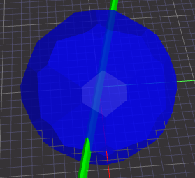

# cgal4gp
Make CGAL (Computational Geometry Algorithms Library) functionality available for PARI/GP.

See sections [prerequisites](#prerequisites) and [tested environments](#tested-environments) below.  
A first application is described in section [ternary quadratic form width](#ternary-quadratic-form-width).  
See CGAL [Basic_Viewer](Basic_Viewer/) opened by ```CGAL_draw()``` in PARI/GP, after ```CGAL_convex_hull_3(points)```.

[JSCAD app link](https://jscad.app/#data:application/gzip;base64,H4sIAMXYkmYAA1XPPWvDMBAG4F2/4rbYIFt206lQKHTp2N14UJWLo2LpVH20ocb/vYpqQiI06F4exHtCwClGF56EmHQ8pY9WkRFv6I20tgk/Qk1yfpwcE4IpsiHCZ1DyAM/g8Stpj9XupSTC0AFnbaddvcEFJiSzhzXjQtrLjNFrDFeiaCavf/FGlSgwdkxWRU0WjNS2ctJLE2pYGICLIeth6Dl0+Y4chgcOzWXc3jlu+pFnu51hf2fvaT+OLFOPMXl7rVQNHe94z/M//5u0R0/mnbSN4ZXsN56rXKSu2cpYXj7N2OLZkS/lltIaVvYH5sr/umEBAAA=) illustrating the demo (left) and PARI/GP CGAL Basic Viewer demo animation:  
   

Vertical prototype, now with 7 functions from CGAL:
```
$ make clean
rm -f *.o libcgal4gp.so
$ make
g++  -O3 -ffp-contract=off -fno-strict-aliasing -fPIC -Wall -pedantic -Wextra -Wno-psabi  -c -o cgal4gp.o cgal4gp.cpp
/usr/bin/g++ -o libcgal4gp.so -shared -Wl,-shared  cgal4gp.o -lc -lm -lgmp
gp -q < simple.gp
- Width([[1, 0, 0], [2, -1, 0], [2, 0, -1], [3, 0, 0], [2, 1, 0], [2, 0, 1]])
- get_squared_width(num,denom)
67108864/50331648
4/3
- get_width_planes(e1,e2)
[32768, 32768, 32768, -98304] [32768, 32768, 32768, -32768]
- get_width_coefficients(A,B,C,D,K)
32768 32768 32768 -98304 -32768
width-plane e1(e2) is given by the equation Ax+By+Cz+D(K)=0
- get_build_direction()
[4096, 4096, 4096]
- get_all_build_directions(dir)
[[4096, 4096, 4096], [4096, -4096, 4096], [-4096, -4096, 4096], [-4096, 4096, 4096], [-4096, 4096, -4096], [4096, 4096, -4096], [4096, -4096, -4096], [-4096, -4096, -4096]]
- get_number_of_optimal_solutions()
8
workaround(all build directions): [[1, -1, -1], [1, -1, 1], [1, 1, -1], [1, 1, 1]]
$ 
```

[simple.gp](simple.gp)  
```
read("cgal4gp.gp");

points=[[1,0,0],[2,-1,0],[2,0,-1],[3,0,0],[2,1,0],[2,0,1]];

print("- Width(",points,")");
CGAL_Width(points);

print("- get_squared_width(num,denom)");
CGAL_get_squared_width(num,denom);
print(num,"/",denom);
num/denom

print("- get_width_planes(e1,e2)");
CGAL_get_width_planes(e1,e2);
print(e1," ",e2);

print("- get_width_coefficients(A,B,C,D,K)");
CGAL_get_width_coefficients(A,B,C,D,K);
print(A," ",B," ",C," ",D," ",K);
print("width-plane e1(e2) is given by the equation Ax+By+Cz+D(K)=0"); 

print("- get_build_direction()");
CGAL_get_build_direction()

print("- get_all_build_directions(dir)");
CGAL_get_all_build_directions(dir);
dir

print("- get_number_of_optimal_solutions()");
CGAL_get_number_of_optimal_solutions()

print("workaround(all build directions): ", Set([d/gcd(d)*if(d[1]<0,-1,1) | d<-dir]));
```

CGAL doc on pointset width related functions, with detailed problem description:  
https://doc.cgal.org/latest/Polytope_distance_d/classCGAL_1_1Width__3.html  
  
[cgal4gp.gp](cgal4gp.gp)
```
\\ https://doc.cgal.org/latest/Polytope_distance_d/classCGAL_1_1Width__3.html
\\
install("Width",                           "vG",     "CGAL_Width",                           "./libcgal4gp.so");

install("get_squared_width",               "v&&",    "CGAL_get_squared_width",               "./libcgal4gp.so");
install("get_width_planes",                "v&&",    "CGAL_get_width_planes",                "./libcgal4gp.so");
install("get_width_coefficients",          "v&&&&&", "CGAL_get_width_coefficients",          "./libcgal4gp.so");
install("get_build_direction",             "m",      "CGAL_get_build_direction",             "./libcgal4gp.so");
install("get_all_build_directions",        "v&",     "CGAL_get_all_build_directions",        "./libcgal4gp.so");
install("get_number_of_optimal_solutions", "i",      "CGAL_get_number_of_optimal_solutions", "./libcgal4gp.so");
```

Code cleanup done with help of these two Makefile targets:  
```
$ make cpplint
cpplint --filter=-legal/copyright cgal4gp.cpp
Done processing cgal4gp.cpp
$ make cppcheck
cppcheck --enable=all --suppress=missingIncludeSystem cgal4gp.cpp --check-config
Checking cgal4gp.cpp ...
$ 
```

## prerequisites

These libs need to be installed:  
- libpari-dev
- libgmp-dev
- libcgal-dev (*)

(*) Under termux on Android there is no such package, install with these commands instead:  
```
$ git clone https://github.com/CGAL/cgal.git
$ cd cgal                         
~/cgal $ for d in `find . -type d | grep "include/CGAL$"`
> do                                
> cp -r $d ../../usr/include/       
> done                              
~/cgal $ 
```


## tested environments

Only 64bit OSes were tested, all successfully:  

OS                   | CPU brand | model         | compiler | version
---------------------|-----------|---------------|----------|--------
Ubuntu 22.04         | AMD       | Ryzen 9 7950X | g++      | (Ubuntu 11.4.0-1ubuntu1~22.04)
Ubuntu 22.04         | Intel     | Celeron J4105 | g++      | (Ubuntu 11.4.0-1ubuntu1~22.04)
Raspberry Pi OS      | ARM       | Cortex-A76    | g++      | (Debian 12.2.0-14)
Android 13           | Qualcomm  | Kryo-460      | clang++  | 17.0.4

On Android clang++ seems to be standard C++ compiler, g++ is just symbolic link to it:  


## ternary quadratic form width

In 1850 Dirichlet proposed a method for determining a ternary quadratic form ```Q``` for mumber ```n```, and matrix ```G``` with ```G~*Q*G==matdiagonal([1,1,1])```. Then ```norml2(G^-1*[0,0,1]~)==n```, and a sum of 3 squares representation for ```n``` is computed.

Initial code drop, work in progress ...

In case of no vstart, width of lattice sphere for n (blue) is computed:  
```
$ p=5 q=13 gp -q < tqf_width.gp 
n=65
#S=96
squared width: 676/3 [102072582144/452984832]
build direction: [-12288, -12288, -12288]
optimal solutions: 32
workaround(all build directions): [[1, -1, -1], [1, -1, 1], [1, 1, -1], [1, 1, 1]]
$ 
```

  

Otherwise width of linear transformation G applied to lattice sphere (green) is computed:  
```
$ dbg=1 p=5 q=13 vstart=1 gp -q < tqf_width.gp 
n=65
next vstart: 3
 Q=[10, 111, 1; 111, 1234, 0; 1, 0, 65]
 G=[-67, -189, -200; 6, 17, 18; 1, 3, 3]
 G^-1=[-3, -33, -2; 0, -1, 6; 1, 12, -5]
#S=96
squared width: 2500/12669 [167772160000/850202198016]
build direction: [81920, 917504, -40960]
optimal solutions: 8
workaround(all build directions): [[10, 112, -5]]
$ 
```

## cgal4gp work originated new CGAL issue(s) 

* https://github.com/CGAL/cgal/issues/8358
