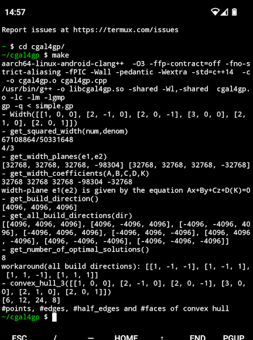

# cgal4gp
Make CGAL (Computational Geometry Algorithms Library) functionality available for PARI/GP.

See sections [prerequisites](#prerequisites) and [tested environments](#tested-environments) below.

[JSCAD app link](https://jscad.app/#data:application/gzip;base64,H4sIAMXYkmYAA1XPPWvDMBAG4F2/4rbYIFt206lQKHTp2N14UJWLo2LpVH20ocb/vYpqQiI06F4exHtCwClGF56EmHQ8pY9WkRFv6I20tgk/Qk1yfpwcE4IpsiHCZ1DyAM/g8Stpj9XupSTC0AFnbaddvcEFJiSzhzXjQtrLjNFrDFeiaCavf/FGlSgwdkxWRU0WjNS2ctJLE2pYGICLIeth6Dl0+Y4chgcOzWXc3jlu+pFnu51hf2fvaT+OLFOPMXl7rVQNHe94z/M//5u0R0/mnbSN4ZXsN56rXKSu2cpYXj7N2OLZkS/lltIaVvYH5sr/umEBAAA=) illustrating the demo:  


Vertical prototype, now with 7 functions from CGAL:
```
$ make clean
rm -f *.o libcgal4gp.so
$ make
g++  -O3 -ffp-contract=off -fno-strict-aliasing -fPIC -Wall -pedantic -Wextra -Wno-psabi  -c -o cgal4gp.o cgal4gp.cpp
/usr/bin/g++ -o libcgal4gp.so -shared -Wl,-shared  cgal4gp.o -lc -lm -lgmp
gp -q < simple.gp
- Width([[1, 0, 0], [2, -1, 0], [2, 0, -1], [3, 0, 0], [2, 1, 0], [2, 0, 1]])
- get_squared_width(num,denom)
67108864/50331648
4/3
- get_width_planes(e1,e2)
[32768, 32768, 32768, -98304] [32768, 32768, 32768, -32768]
- get_width_coefficients(A,B,C,D,K)
32768 32768 32768 -98304 -32768
width-plane e1(e2) is given by the equation Ax+By+Cz+D(K)=0
- get_build_direction()
[4096/1, 4096/1, 4096/1]
- get_all_build_directions(dir)
[[4096/1, 4096/1, 4096/1], [4096/1, -4096/1, 4096/1], [-4096/1, -4096/1, 4096/1], [-4096/1, 4096/1, 4096/1], [-4096/1, 4096/1, -4096/1], [4096/1, 4096/1, -4096/1], [4096/1, -4096/1, -4096/1], [-4096/1, -4096/1, -4096/1]]
- get_number_of_optimal_solutions()
8
$ 
```

[simple.gp](simple.gp)  
```
read("cgal4gp.gp");

points=[[1,0,0],[2,-1,0],[2,0,-1],[3,0,0],[2,1,0],[2,0,1]];

print("- Width(",points,")");
Width(points);

print("- get_squared_width(num,denom)");
get_squared_width(num,denom);
print(num,"/",denom);
num/denom

print("- get_width_planes(e1,e2)");
get_width_planes(e1,e2);
print(e1," ",e2);

print("- get_width_coefficients(A,B,C,D,K)");
get_width_coefficients(A,B,C,D,K);
print(A," ",B," ",C," ",D," ",K);
print("width-plane e1(e2) is given by the equation Ax+By+Cz+D(K)=0"); 

print("- get_build_direction()");
get_build_direction()

print("- get_all_build_directions(dir)");
get_all_build_directions(dir);
dir

print("- get_number_of_optimal_solutions()");
get_number_of_optimal_solutions()
```

CGAL doc on pointset width related functions, with detailed problem description:  
https://doc.cgal.org/latest/Polytope_distance_d/classCGAL_1_1Width__3.html  
[cgal4gp.gp](cgal4gp.gp)
```
\\ https://doc.cgal.org/latest/Polytope_distance_d/classCGAL_1_1Width__3.html
\\
install("Width",                           "vG",     , "./libcgal4gp.so");

install("get_squared_width",               "v&&",    , "./libcgal4gp.so");
install("get_width_planes",                "v&&",    , "./libcgal4gp.so");
install("get_width_coefficients",          "v&&&&&", , "./libcgal4gp.so");
install("get_build_direction",             "m",      , "./libcgal4gp.so");
install("get_all_build_directions",        "v&",     , "./libcgal4gp.so");
install("get_number_of_optimal_solutions", "i",      , "./libcgal4gp.so");
```

Code cleanup done with help of these two Makefile targets:  
```
$ make cpplint
cpplint --filter=-legal/copyright cgal4gp.cpp
Done processing cgal4gp.cpp
$ make cppcheck
cppcheck --enable=all --suppress=missingIncludeSystem cgal4gp.cpp --check-config
Checking cgal4gp.cpp ...
$ 
```

## prerequisites

These libs need to be installed:  
- libpari-dev
- libgmp-dev
- libcgal-dev (*)

(*) Under termux on Android there is no such package, install with these commands instead:  
```
$ git clone https://github.com/CGAL/cgal.git
$ cd cgal                         
~/cgal $ for d in `find . -type d | grep "include/CGAL$"`
> do                                
> cp -r $d ../../usr/include/       
> done                              
~/cgal $ 
```


## tested environments

Only 64bit OSes were tested, all successfully:  

OS                   | CPU brand | model         | compiler | version
---------------------|-----------|---------------|----------|--------
Ubuntu 22.04         | AMD       | Ryzen 9 7950X | g++      | (Ubuntu 11.4.0-1ubuntu1~22.04)
Ubuntu 22.04         | Intel     | Celeron J4105 | g++      | (Ubuntu 11.4.0-1ubuntu1~22.04)
Raspberry Pi OS      | ARM       | Cortex-A76    | g++      | (Debian 12.2.0-14)
Android 13           | Qualcomm  | Kryo-460      | clang++  | 17.0.4

On Android clang++ seems to be standard C++ compiler, g++ is just symbolic link to it:  

