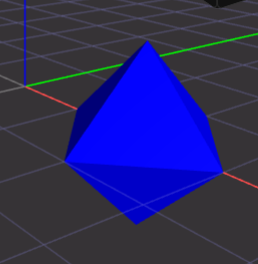

# cgal4gp
Make CGAL functionality available for PARI/GP.

Needs these libs to be installed:  
- libpari-dev
- libgmp-dev
- libcgal-dev

[JSCAD app link](https://jscad.app/#data:application/gzip;base64,H4sIAMXYkmYAA1XPPWvDMBAG4F2/4rbYIFt206lQKHTp2N14UJWLo2LpVH20ocb/vYpqQiI06F4exHtCwClGF56EmHQ8pY9WkRFv6I20tgk/Qk1yfpwcE4IpsiHCZ1DyAM/g8Stpj9XupSTC0AFnbaddvcEFJiSzhzXjQtrLjNFrDFeiaCavf/FGlSgwdkxWRU0WjNS2ctJLE2pYGICLIeth6Dl0+Y4chgcOzWXc3jlu+pFnu51hf2fvaT+OLFOPMXl7rVQNHe94z/M//5u0R0/mnbSN4ZXsN56rXKSu2cpYXj7N2OLZkS/lltIaVvYH5sr/umEBAAA=) illustrating the demo:  


Vertical prototype:
```
$ make
g++  -O3 -ffp-contract=off -fno-strict-aliasing -fPIC -Wall -pedantic -Wextra -Wno-psabi  -c -o cgal4gp.o cgal4gp.cpp
/usr/bin/g++ -o libcgal4gp.so -shared -Wl,-shared  cgal4gp.o -lc -lm -lgmp
gp -q < simple.gp
get_squared_width([[1, 0, 0], [2, -1, 0], [2, 0, -1], [3, 0, 0], [2, 1, 0], [2, 0, 1]])
67108864/50331648
4/3
$ 
```

```
$ cat simple.gp 
read("cgal4gp.gp");

points=[[1,0,0],[2,-1,0],[2,0,-1],[3,0,0],[2,1,0],[2,0,1]];
get_squared_width(points,num,denom);
print("get_squared_width(",points,")");
print(num,"/",denom);
num/denom
$ 
```

```
$ cat cgal4gp.gp 
install("get_squared_width", "vG&&", , "./libcgal4gp.so");
$ 
```
